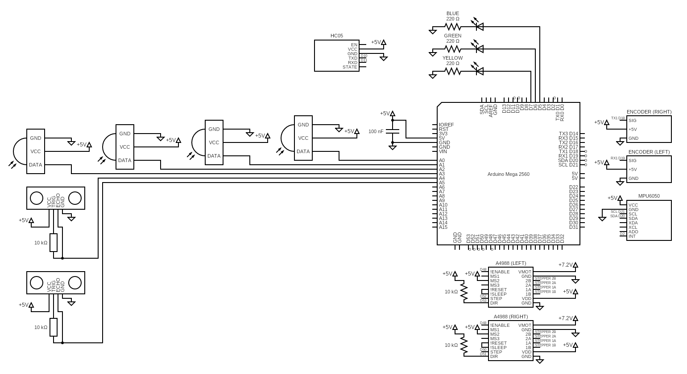

# Walter-ECE425-Mobile-Robotics
## Equipment

### Controllers
1x Breadboard

1x Arduino Uno

1x Arduino Mega2560

### Sensors
2x SHARP 2Y0A21 IR Sensors

2x SHARP 2D120X IR Sensors

2x HC-SR04 Sonar Sensors

2x Photoresistors

1x MPU6050 3-axis Gyroscope and 3-axis Accelerometer

### Motors
2x 42HS40DF306 Stepper Motors with Encoders

2x A4988 Stepper Motor Drivers

### Communications
2x NRF24L01+ Wireless Transceivers

1x HC05 Bluetooth Module

### Power
2x 7.2Vdc 5000mAh Rechargeable Batteries

1x TENERGY Charger

## Hardware Connections

## Robot Characteristics

### Robot Dimensions

### Robot Calibration

#### HC-SR04 Sonar Sensors

#### SHARP 2Y0A21 IR Sensors

#### SHARP 2D120X IR Sensors

#### MPU6050 3-axis Gyroscope and 3-axis Accelerometer

#### HC05 Bluetooth Module

#### A4988 Stepper Motor Drivers

## File Storage

## Purpose of Labs

## Final Project
